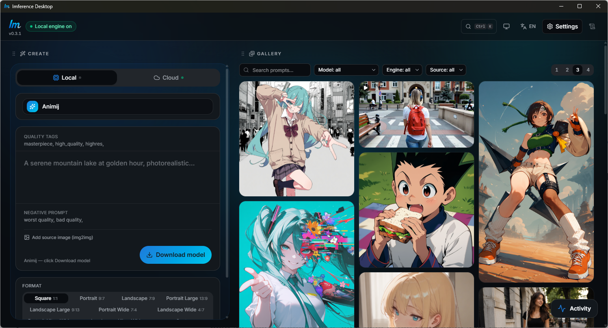

<div align="center">


# Imference Desktop

**Generate AI images and videos — on your own GPU or in the cloud. One app.**

Free · No subscription · Windows & macOS

[](https://github.com/Publikey/imference-desktop/releases/latest)
[](https://github.com/Publikey/imference-desktop/releases)
[](https://github.com/Publikey/imference-desktop/actions)
[](LICENSE)
[](https://github.com/Publikey/imference-desktop/stargazers)
[](#download)

**English** · [简体中文](README.zh-CN.md)

[**Download**](#download) · [Quick start](#quick-start) · [Website](https://imference.com/desktop) · [Contributing](CONTRIBUTING.md) · [Security](SECURITY.md)



</div>

<a id="download"></a>

## ⬇️ Download

| Platform | Download |
|---|---|
| **Windows** 10/11 (x64) | [**Installer**](https://github.com/Publikey/imference-desktop/releases/latest/download/imference-desktop-go-windows-amd64-installer.exe) · [Portable .exe](https://github.com/Publikey/imference-desktop/releases/latest/download/imference-desktop-go-windows-amd64.exe) |
| **macOS** 12+ (Intel & Apple Silicon) | [**.dmg**](https://github.com/Publikey/imference-desktop/releases/latest/download/imference-desktop-go-macos-universal.dmg) |
| **Linux** | No prebuilt binary yet — [build from source](#build-from-source) |

All versions and `checksums.txt` (SHA-256) are on the
[**Releases**](https://github.com/Publikey/imference-desktop/releases) page.

<a id="quick-start"></a>

## 🚀 Quick start

1. **Download** the installer for your OS above and run it.
2. **Open the app** — it installs its own inference engine and detects your GPU.
   Nothing touches your system Python.
3. **Pick a model, hit Generate** — the weights download automatically and every
   model ships pre-tuned, so your first image already looks right.

No GPU? Switch the toggle to **Cloud** in step 3 and generate on
[imference.com](https://imference.com) instead.

### ⚠️ First launch

The app isn't code-signed yet, so your OS shows a one-time warning. This is
expected — here's how to get past it:

- **Windows** — SmartScreen popup → click **More info** → **Run anyway**.
- **macOS** — right-click the app → **Open** → **Open**.
  If macOS still refuses: `xattr -cr "/Applications/Imference Desktop.app"`

You can verify your download against `checksums.txt` from the release.
The app checks for new versions at startup and shows a banner when one is
available; code signing and silent in-app auto-update are on the roadmap.

## Why Imference Desktop

- ⚡ **One-click setup** — the app installs an isolated inference engine for
  you (nothing touches your system Python), detects your GPU, and starts and
  stops the engine on demand. No terminal, no CUDA wrestling.
- 🖥️ **Local generation, $0 per image** — run **eight model families** on your
  own GPU: **SDXL, SD 1.5, Z-Image, FLUX, Chroma, Qwen-Image, Anima and
  Krea 2**. Your prompts and images never leave your machine.
- 🧩 **Preconfigured models, zero setup** — pick a model from the curated
  catalog and hit Generate: the weights **download automatically**, and every
  model ships pre-tuned (steps, CFG, resolutions, quality tags, negative
  prompt) so your first image already looks right.
- 📦 **Bring your own model** — load any local `.safetensors` checkpoint
  (e.g. downloaded from Civitai) and pick its family. The file is used in
  place — nothing is copied or uploaded.
- ☁️ **Cloud when you want it** — no GPU or a weak one? Generate images and
  **video** on [imference.com](https://imference.com) from the same interface.
  Pay with an **API key (credits)** or **x402 (USDC on Base)** — the x402
  route needs no account at all.
- 🎛️ **Real controls, simple interface** — format, steps, CFG, seed, quality
  tags, negative prompt, **image-to-image**. Stack generations in a queue,
  and even switch models mid-run — the app finishes the current image first.
- 🗂️ **A gallery that remembers everything** — every image and video is saved
  with its prompt, model and settings. Filter, search, and review in a
  fullscreen viewer.

<div align="center">

<!-- More screenshots: drop captures in docs/screenshots/ then uncomment -->
<!--
 
-->

</div>

## Requirements

| Mode | What you need |
|---|---|
| **Local** | Windows: an NVIDIA GPU (CUDA), or an AMD Radeon RX 7000/9000 (ROCm preview — needs Python 3.12 + a recent Adrenalin driver) · macOS: Apple Silicon. ~6–13 GB disk per model. |
| **Cloud** | Any machine — an [imference.com API key](https://imference.com/payments), or a funded x402 wallet. |

Linux (NVIDIA CUDA / AMD ROCm) is supported by the engine and builds from
source, but there's no prebuilt binary yet — see
[Build from source](#build-from-source).

Learn more about the app on the
[imference.com/desktop](https://imference.com/desktop) page.

## Feedback

This is an early public release — rough edges are expected.

- 🐛 **Something broken?** [Open an issue](https://github.com/Publikey/imference-desktop/issues/new/choose) — it directly shapes what gets built next.
- 💬 **A question, or not sure it's a bug?** [Discussions → Q&A](https://github.com/Publikey/imference-desktop/discussions/categories/q-a) — GPU support, install trouble, how-to.
- 🖼️ **Made something good?** [Show and tell](https://github.com/Publikey/imference-desktop/discussions/categories/show-and-tell).

<a id="build-from-source"></a>

<details>
<summary><b>Build from source</b></summary>

Built with [Wails v3](https://v3alpha.wails.io) (Go + React). This is also how
to run it on Linux, which the release workflow doesn't package yet.

Requires [Go](https://go.dev) 1.25+, [Node](https://nodejs.org) 20+, and the
Wails3 CLI:

```bash
go install github.com/wailsapp/wails/v3/cmd/wails3@v3.0.0-alpha2.116

wails3 dev      # run in dev mode (hot reload)
wails3 package  # production build + platform packaging (NSIS on Windows)
```

Releases are built automatically by GitHub Actions on a pushed `v*` tag
(see [`.github/workflows/release.yml`](.github/workflows/release.yml)).

See [CONTRIBUTING.md](CONTRIBUTING.md) for the repo layout, the checks to run
before a PR, and how to add a language.

</details>

## License

[MIT](LICENSE) © Publikey Sàrl

Model weights are **not** covered by this license — each model on the catalog
carries its own terms (CreativeML, FLUX non-commercial, Apache-2.0…). Check the
license of any model you use, especially commercially.

Found a security issue? See [SECURITY.md](SECURITY.md) — please don't open a
public issue.
