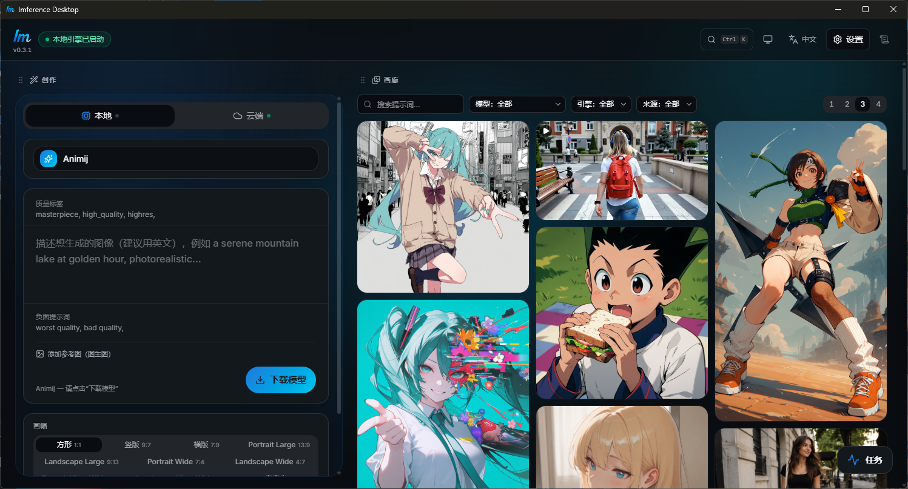

<div align="center">


# Imference Desktop

**生成 AI 图像与视频 — 用自己的 GPU，或用云端。一个应用搞定。**

免费 · 无订阅 · Windows & macOS

[](https://github.com/Publikey/imference-desktop/releases/latest)
[](https://github.com/Publikey/imference-desktop/releases)
[](https://github.com/Publikey/imference-desktop/actions)
[](LICENSE)
[](https://github.com/Publikey/imference-desktop/stargazers)
[](#download)

[English](README.md) · **简体中文**

[**下载**](#download) · [快速开始](#quick-start) · [官网](https://imference.com/desktop) · [参与贡献](CONTRIBUTING.md) · [安全](SECURITY.md)



</div>

<a id="download"></a>

## ⬇️ 下载

| 平台 | 下载 |
|---|---|
| **Windows** 10/11 (x64) | [**安装程序**](https://github.com/Publikey/imference-desktop/releases/latest/download/imference-desktop-go-windows-amd64-installer.exe) · [便携版 .exe](https://github.com/Publikey/imference-desktop/releases/latest/download/imference-desktop-go-windows-amd64.exe) |
| **macOS** 12+（Intel 和 Apple Silicon） | [**.dmg**](https://github.com/Publikey/imference-desktop/releases/latest/download/imference-desktop-go-macos-universal.dmg) |
| **Linux** | 暂无预编译版本 — 请[从源码构建](#build-from-source) |

所有版本和 `checksums.txt`（SHA-256）见
[**Releases**](https://github.com/Publikey/imference-desktop/releases) 页面。

<a id="quick-start"></a>

## 🚀 快速开始

1. **下载**上方对应系统的安装程序并运行。
2. **打开应用** — 它会自动安装自带的推理引擎并检测 GPU，全程不影响系统 Python。
3. **选一个模型，点击生成** — 权重自动下载，每个模型都已预调好参数，
   第一张图就有不错的效果。

没有 GPU？在第 3 步把开关切到**云端**，直接在
[imference.com](https://imference.com) 上生成。

### ⚠️ 首次启动

应用暂未进行代码签名，因此系统会显示一次性警告。这是正常现象，通过方式如下：

- **Windows** — SmartScreen 弹窗 → 点击**更多信息** → **仍要运行**。
- **macOS** — 右键点击应用 → **打开** → **打开**。
  如果 macOS 仍然拒绝：`xattr -cr "/Applications/Imference Desktop.app"`

你可以用 Release 中的 `checksums.txt` 校验下载文件。
应用启动时会检查新版本并显示提示横幅；代码签名和应用内静默自动更新已列入路线图。

## 为什么选择 Imference Desktop

- ⚡ **一键安装，开箱即用** — 应用会为你安装一个隔离的推理引擎（不影响系统
  Python），自动检测 GPU，并按需启动 / 停止引擎。无需命令行，无需折腾 CUDA。
- 🖥️ **本地生成，每张图 0 元** — 在你自己的 GPU 上运行**七大模型家族**：
  **SDXL、SD 1.5、Z-Image、FLUX、Chroma、Qwen-Image 和 Anima**。
  提示词和图片永远不会离开你的电脑。
- 🧩 **预配置模型，零设置** — 从精选目录里选一个模型点击生成即可：权重
  **自动下载**，每个模型都已预调好参数（步数、CFG、分辨率、质量标签、
  负面提示词），第一张图就是对的效果。
- 📦 **自带模型** — 加载任意本地 `.safetensors` 模型文件（例如从 Civitai
  下载的），选好所属家族即可。文件在原位置直接使用 — 不会被复制或上传。
- ☁️ **需要时随时切换云端** — 没有 GPU 或性能不足？在同一界面用
  [imference.com](https://imference.com) 云端生成图像和**视频**。支持
  **API 密钥（积分）** 或 **x402（Base 链 USDC）** 付费 — x402 方式甚至
  无需注册账号。
- 🎛️ **真正的参数控制，界面简洁** — 画幅、步数、CFG、种子、质量标签、
  负面提示词，还支持**图生图**。生成任务可排队，甚至可以在生成中途切换
  模型 — 应用会先完成当前这张图。
- 🗂️ **记住一切的图库** — 每张图片和视频都会连同提示词、模型和参数一起
  保存。支持筛选、搜索和全屏查看。

## 系统要求

| 模式 | 需要什么 |
|---|---|
| **本地** | Windows：NVIDIA GPU（CUDA），或 AMD Radeon RX 7000/9000（ROCm 预览版 — 需要 Python 3.12 和较新的 Adrenalin 驱动）· macOS：Apple Silicon。每个模型约 6–7 GB 磁盘空间。 |
| **云端** | 任何电脑 — 一个 [imference.com API 密钥](https://imference.com/payments)，或一个有余额的 x402 钱包。 |

Linux（NVIDIA CUDA / AMD ROCm）引擎本身已支持，也可以从源码构建，
但目前还没有预编译版本 — 见[从源码构建](#build-from-source)。

更多信息见 [imference.com/desktop](https://imference.com/desktop) 页面。

### 🌐 界面语言

应用会自动跟随系统语言（支持英文和简体中文），也可以在
**设置 → 语言** 中手动切换。

## 反馈

这是一个早期公开版本，难免存在粗糙之处。

- 🐛 **遇到问题？**[提交 issue](https://github.com/Publikey/imference-desktop/issues/new/choose) — 它会直接影响后续开发方向。
- 💬 **有疑问，或不确定是不是 bug？**[Discussions → Q&A](https://github.com/Publikey/imference-desktop/discussions/categories/q-a) — 显卡支持、安装问题、使用技巧。
- 🖼️ **生成了满意的作品？**欢迎在 [Show and tell](https://github.com/Publikey/imference-desktop/discussions/categories/show-and-tell) 分享。

<a id="build-from-source"></a>

<details>
<summary><b>从源码构建</b></summary>

基于 [Wails v3](https://v3alpha.wails.io)（Go + React）构建。
在 Linux 上运行也走这条路径 — 发布流程目前还不打包 Linux 版本。

需要 [Go](https://go.dev) 1.25+、[Node](https://nodejs.org) 20+ 和
Wails3 CLI：

```bash
go install github.com/wailsapp/wails/v3/cmd/wails3@v3.0.0-alpha2.116

wails3 dev      # 开发模式（热重载）
wails3 package  # 生产构建 + 平台打包（Windows 上为 NSIS）
```

发布版本由 GitHub Actions 在推送 `v*` 标签时自动构建
（见 [`.github/workflows/release.yml`](.github/workflows/release.yml)）。

仓库结构、提交 PR 前需要跑的检查，以及如何新增语言，见
[CONTRIBUTING.md](CONTRIBUTING.md)。

</details>

## 许可证

[MIT](LICENSE) © Publikey Sàrl

模型权重**不在**本许可证范围内 — 目录中的每个模型都有各自的授权条款
（CreativeML、FLUX 非商用、Apache-2.0 等）。使用任何模型前请先确认其许可证，
商用场景尤其如此。

发现安全问题？请见 [SECURITY.md](SECURITY.md) — 不要提交公开 issue。
